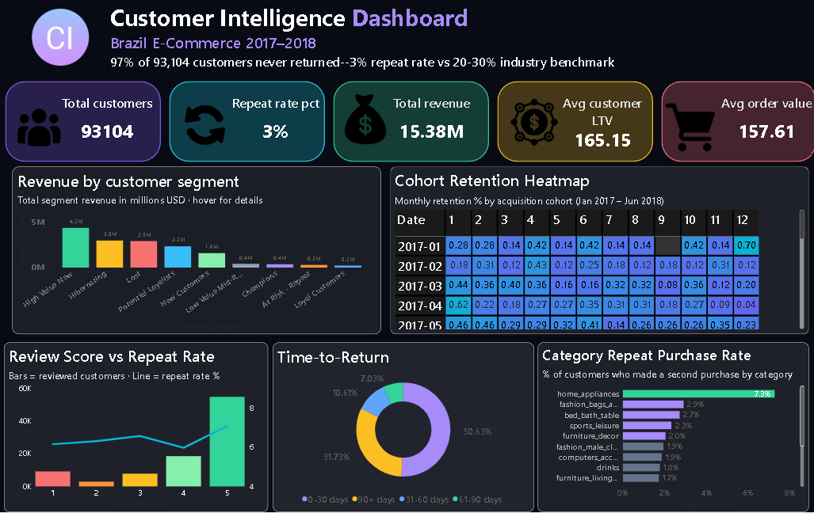

# Customer Retention & Repeat Purchase Analysis

> Analyzed 93,104 customers from Olist Brazilian E-Commerce using Google BigQuery to identify that 97% of customers never returned — and built a complete retention intelligence system using RFM segmentation, cohort analysis, and CLV calculation to identify $15.4M in dormant customer value.

---

## Project Overview

This project analyzes customer retention behavior on Olist — Brazil's largest e-commerce marketplace. The central business problem: despite acquiring thousands of new customers monthly, only 3% ever made a second purchase — dramatically below the industry average of 20-30%.

**Business Problem:** Olist was investing heavily in customer acquisition without understanding whether acquired customers were returning. The business needed to know who their best customers were, why customers were not coming back, and where to focus retention investment.

**My Role:** Data Analyst — responsible for building a customer master table from 9 relational tables, performing RFM segmentation, cohort retention analysis, CLV calculation, and delivering prioritized business recommendations.

---

## Tools and Technologies

| Tool | Purpose |
|---|---|
| Google BigQuery | Cloud data warehouse — all SQL analysis |
| Olist Dataset (Kaggle) | Real Brazilian e-commerce transaction data |
| Power BI | Interactive dashboard — dark theme |
| SQL | Multi-table JOINs, CTEs, window functions |

---

## Dataset

- **Source:** Olist Brazilian E-Commerce Dataset (Kaggle)
- **Tables:** 9 relational tables
- **Period:** 2017 to 2018
- **Size:** 99,441 orders | 96,096 unique customers
- **Key Challenge:** Data spread across 9 tables required careful multi-table JOIN design. customer_id and customer_unique_id are different fields — a critical distinction for accurate retention analysis.

---

## Database Schema

```
customers ──── orders ──── order_items ──── products
                  │                              │
                  │                    category_translation
                  │
              order_payments
                  │
              order_reviews
```

---

## Business Questions Answered

1. What percentage of customers make a repeat purchase?
2. Who are our highest value customers using RFM segmentation?
3. What is the average customer lifetime value by segment?
4. Which customer cohort has the best retention rate?
5. How quickly do customers churn after their first purchase?
6. Which product categories drive the most repeat purchases?
7. Which customer segments contribute most to total revenue?
8. What is the average time between first and second purchase?
9. Which customers are at risk of churning right now?
10. Which segment should the business focus on first and why?

---

## Key Findings

### 1. The Retention Crisis

| Metric | Olist | Industry Benchmark |
|---|---|---|
| Repeat Purchase Rate | 3% | 20-30% |
| Month 1 Cohort Retention | 0.28% | 20-25% |
| Single Purchase Customers | 97% | 70-80% |
| Avg Days Since Last Purchase | 239 days | Varies |

97% of customers never returned. This is not a retention problem — it is a retention crisis. The business is entirely dependent on new customer acquisition with virtually zero compounding customer value.

---

### 2. RFM Customer Segments

| Segment | Customers | Avg CLV | Total Revenue | Revenue Share |
|---|---|---|---|---|
| High Value New | 14,370 | $302 | $4,342,007 | 28.24% |
| Hibernating | 18,062 | $163 | $2,956,128 | 19.23% |
| Lost | 18,190 | $159 | $2,902,138 | 18.87% |
| Potential Loyalists | 10,539 | $220 | $2,327,569 | 15.14% |
| New Customers | 21,674 | $72 | $1,580,385 | 10.28% |
| Champions | 978 | $373 | $365,332 | 2.38% |
| At Risk Repeat | 990 | $295 | $292,606 | 1.90% |
| Loyal Customers | 821 | $247 | $202,816 | 1.32% |

**Critical insight:** High Value New customers — 14,370 buyers who spent $302 on average — generate 28.24% of all revenue from a single purchase. Converting even 10% to repeat buyers would generate $4.3M in additional lifetime revenue.

---

### 3. Cohort Retention Analysis

Month 1 retention across all 20 cohorts:

```
Best cohort  (Oct 2017): 0.72% Month 1 retention
Worst cohort (Dec 2017): 0.21% Month 1 retention
Average across all cohorts: ~0.45% Month 1 retention
```

December 2017 is the worst performing cohort — likely holiday gift buyers who had no intent to return. October 2017 is the strongest cohort.

Retention never exceeds 1% in any month across any cohort — confirming a systemic platform retention failure rather than isolated incidents.

---

### 4. Time to Second Purchase

| Window | Customers | % of Repeat Buyers |
|---|---|---|
| 0-30 days | 1,412 | 50.6% |
| 31-60 days | 296 | 10.6% |
| 61-90 days | 196 | 7.0% |
| 90+ days | 885 | 31.7% |

50% of repeat buyers return within 30 days of first purchase. This identifies the first 30 days after acquisition as the critical retention window — the optimal time for re-engagement campaigns.

---

### 5. Category Repeat Purchase Rates

| Category | Total Customers | Repeat Rate |
|---|---|---|
| Home Appliances | 688 | 7.27% |
| Fashion Bags | 1,750 | 2.91% |
| Bed Bath Table | 9,003 | 2.72% |
| Sports Leisure | 7,324 | 2.32% |
| Health Beauty | 8,462 | 1.67% |

Home appliances leads at 7.27% — customers furnishing homes or offices buy multiple items over time. Health and beauty surprisingly low at 1.67% despite being a typically high-repeat category globally — suggesting strong competition from dedicated beauty platforms in Brazil.

---

### 6. Review Score vs Repeat Purchase

| Review Score | Repeat Rate | Avg Revenue |
|---|---|---|
| 5 stars | 7.09% | $168 |
| 4 stars | 5.98% | $164 |
| 3 stars | 6.58% | $162 |
| 2 stars | 6.32% | $182 |
| 1 star | 6.16% | $204 |

Satisfaction score barely predicts repeat purchase — the gap between 5-star and 1-star retention is less than 1 percentage point. Platform convenience drives return visits more than satisfaction scores. 1-star customers have the highest average revenue ($204) — they are high-value buyers with high expectations, worth winning back specifically.

---

## Business Recommendations

**Priority 1 — 30-Day Re-engagement Campaign (High Value New Segment)**

14,370 customers spent $302 on average but never returned. They are still within 94 days of their last purchase — reachable. A personalized email or push notification campaign sent 7-14 days after first delivery, featuring complementary products, could convert 10% to repeat buyers.

Estimated impact: 1,437 additional transactions × $302 = $433,774 additional revenue.

**Priority 2 — Win-Back Campaign (At Risk Repeat Segment)**

990 customers proved they could be loyal — they bought more than once — but have been silent for 383 days. These customers have the third highest CLV at $295. A targeted discount or loyalty offer could recover a portion of this segment.

Estimated impact: 30% recovery × 990 × $295 = $87,615 additional revenue.

**Priority 3 — Seasonal Retention Strategy (December Cohort)**

December 2017 cohort has the worst Month 1 retention at 0.21% — likely holiday gift buyers. These customers need a different onboarding strategy — post-purchase content, loyalty points, or January promotions — to convert one-time gift buyers into regular customers.

**Priority 4 — Category-Specific Retention (Home Appliances)**

Home appliances has the highest repeat rate at 7.27%. This segment of buyers is in an active household purchasing phase. A category-specific recommendation engine — "customers who bought a blender also bought..." — could accelerate repeat purchases within this high-value segment.

---

## Data Challenges and Solutions

| Challenge | What Happened | Solution |
|---|---|---|
| customer_id vs customer_unique_id | customer_id is unique per order, not per person | Always used customer_unique_id for retention analysis |
| 2016 data sparse | December 2016 had only 1 order | Restricted analysis to 2017-2018 only |
| Category names in Portuguese | product_category_name not in English | Joined category_name_translation table |
| Translation table column names | BigQuery assigned string_field_0/1 as headers | Used string_field_0 and string_field_1 explicitly |
| NULL payment values | 5 delivered orders with zero or null payment | Filtered with payment_value > 0 AND IS NOT NULL |
| Standard NTILE frequency scoring | 97% of customers have frequency=1, making NTILE meaningless | Rebuilt segments using frequency as primary condition first |

The frequency scoring issue was the most analytically significant challenge. Standard RFM scoring incorrectly labeled one-time buyers as Champions because NTILE divided everyone equally regardless of the 97% frequency=1 concentration. Identifying and fixing this prevented a fundamental segmentation error.

---

## SQL Concepts Used

- Multi-table JOINs across 9 relational tables
- Common Table Expressions (CTEs) for query readability
- Window functions: NTILE, ROW_NUMBER, FIRST_VALUE, LEAD
- PARTITION BY for segment-level calculations
- DATE_TRUNC for cohort month grouping
- DATE_DIFF for time between purchase calculations
- Self JOIN for first-to-second purchase gap analysis
- COUNTIF for conditional counting
- COALESCE for NULL handling
- CREATE OR REPLACE TABLE for persistent result storage
- FORMAT_DATE for readable date labels

---

## Dashboard Preview



---

## Project Structure

```
customer-retention-analysis/
│
├── README.md
│
├── queries/
│   └── all_queries.sql
│
├── results/
│   ├── kpi_summary.csv
│   ├── rfm_summary.csv
│   ├── clv_by_segment.csv
│   ├── cohort_data_v2.csv
│   ├── category_repeat.csv
│   ├── review_repeat.csv
│   └── time_to_return.csv
│
├── dashboard/
│   └── customer_retention_dashboard.pbix
│
└── screenshots/
    ├── dashboard_final.png
    └── bigquery_queries.png
```

---

## How This Project Complements Project 1

| Dimension | Project 1 | Project 2 |
|---|---|---|
| Focus | Acquisition and conversion | Retention and loyalty |
| Data structure | Nested ARRAY in BigQuery | 9-table relational schema |
| Key technique | UNNEST, funnel construction | RFM, cohort analysis, CLV |
| Business question | Where do users drop off? | Do customers come back? |
| Dashboard theme | Light | Dark |

Together these two projects cover the complete customer lifecycle — from first visit through purchase conversion to long-term retention.

---

## Author

**Mohd Imran**
Data and product analyst

[LinkedIn] www.linkedin.com/in/mohd-imran-55348a325
[Project 1 — E-Commerce Funnel Analysis](https://github.com/imran-jafry/ecommerce-checkout-funnel-analysis)
